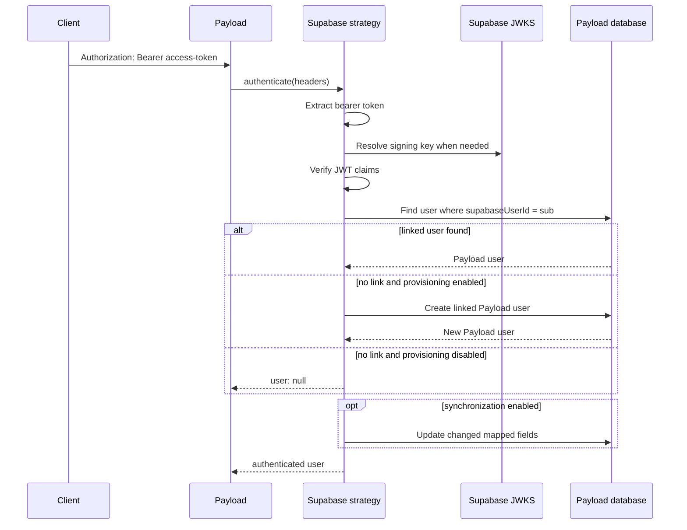

# Architecture

## Scope

The implemented slices authenticate API requests carrying a Supabase access
token and optionally provision or synchronize the linked Payload user. They do
not yet issue Payload sessions or replace the Payload admin login experience.

## Components

### Plugin configuration transformer

`src/plugin.ts` locates `authCollection`, verifies that authentication is
enabled, builds a verifier, and appends the `supabase-bearer` strategy. The
incoming config and collection are not mutated. Existing auth configuration
and custom strategies remain in their original order.

Setting `enabled: false` is a complete no-op and returns the original config
reference.

### Bearer-token extraction

`src/token/extractBearerToken.ts` accepts Fetch-compatible `Headers` and
recognizes exactly one non-whitespace credential using the Bearer scheme. The
scheme comparison is case-insensitive. Missing and malformed values return
`null`.

### Token verification

`src/token/verifyToken.ts` creates a reusable verifier using `jose`.

By default it:

- Loads keys from
  `<issuer>/.well-known/jwks.json`.
- Derives the issuer as `<supabaseUrl>/auth/v1`.
- Requires the `authenticated` audience.
- Accepts only `ES256` and `RS256`.
- Applies `jose` validation for signature, issuer, audience, and registered
  time claims.
- Requires a non-empty string `sub`.

A custom JWKS key resolver can be passed to the verifier factory. A complete
custom verifier can be passed to the plugin or strategy.

### Linked-user resolver

`src/users/resolveLinkedUser.ts` queries the configured collection using:

- The JWT subject as the equality value.
- `supabaseUserId` as the default link field.
- `overrideAccess: true`, because authentication happens before `req.user`
  exists.
- A maximum of two results so duplicate links can be detected.
- Pagination disabled.

No result means the token is valid but not linked. More than one result is an
integrity error. Both conditions fail authentication at the strategy boundary.

### Provisioning and synchronization

`src/users/provisionUser.ts` creates an unlinked user when `provisionUsers` is
enabled. It requires an email, assigns the verified subject to the link field,
uses access override, and generates an unknown random local password.

`src/users/synchronizeUser.ts` updates only mapped fields whose values changed
when `synchronizeUsers` is enabled. It protects the document ID, password,
collection marker, and Supabase link field from claim-driven updates.

Concurrent first requests rely on the collection's unique link constraint. If
an insert loses that race, the strategy resolves the subject once more and
authenticates the user created by the winning request.

The default mapper copies only `email`. A custom `mapClaims` callback is shared
by provisioning and synchronization.

### Payload authentication strategy

`src/strategy/createSupabaseStrategy.ts` composes extraction, verification, and
resolution. A successful result adds Payload's required `collection` and
`_strategy` properties to the resolved user.

The strategy uses collection auth depth for REST requests and depth zero for
GraphQL requests, matching Payload's built-in strategy behavior. It returns
`{ user: null }` on authentication failures so Payload may continue to another
configured strategy.

## Request sequence

## Public composition points

Consumers can use the top-level plugin or compose the lower-level exports:

- `createSupabaseTokenVerifier`
- `createSupabaseStrategy`
- `resolveLinkedUser`
- `extractBearerToken`
- `createExchangeCode`
- `consumeExchangeCode`

The strategy accepts a custom resolver, and both the plugin and strategy accept
a custom verifier. These seams keep unit tests deterministic and allow custom
identity stores or JWKS transports without weakening the default validation.

## Exchange-code primitives

`src/exchange` generates opaque codes with at least 256 bits of entropy, stores
only SHA-256 digests, defaults to a 60-second lifetime, and requires atomic
delete-and-return consumption. Records link a Payload collection and user ID.

Storage is abstracted behind `ExchangeCodeStore`. The included memory store is
limited to tests and single-process development.

`createPayloadExchangeCodeStore` uses the hidden, access-denied
`supabase-exchange-codes` collection. Consumption is one conditional PostgreSQL
`DELETE … RETURNING` statement, making the database choose exactly one winner.
Cleanup deletes expired rows and returns the number removed.

## Planned layers

The repository structure anticipates, but does not yet implement:

- HTTP exchange into a Payload session cookie.
- Callback, exchange, and logout endpoints.
- Supabase-aware Payload admin login and auth provider components.
