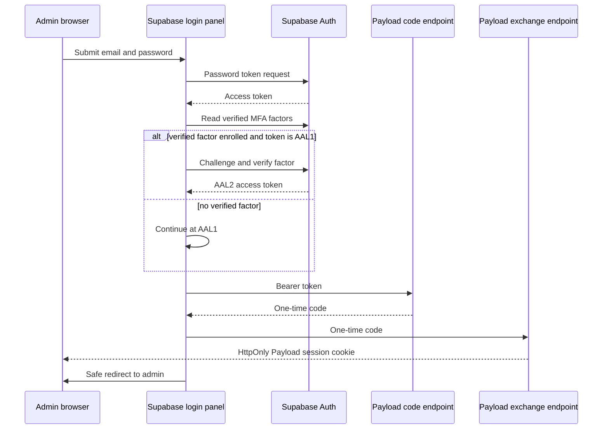
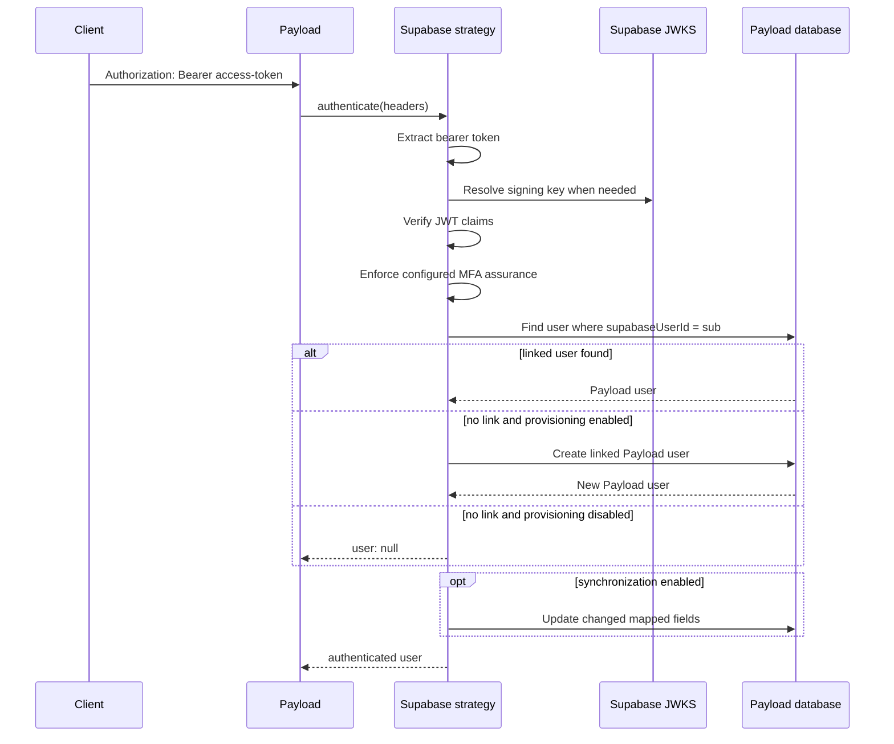

# Architecture

## Scope

The implemented slices authenticate API requests carrying a Supabase access
token, optionally provision or synchronize the linked Payload user, and
exchange a verified bearer identity through a short-lived one-time code into a
Payload session cookie. An opt-in Payload admin panel performs Supabase
email/password login and session exchange; custom OAuth and magic-link flows
can use the same endpoints. Logout uses Payload's existing auth-collection
endpoint.

## Components

### Plugin configuration transformer

`src/plugin.ts` locates `authCollection`, verifies that authentication is
enabled, builds a verifier, and appends the `supabase-bearer` strategy. The
incoming config and collection are not mutated. Existing auth configuration
and custom strategies remain in their original order.

Setting `enabled: false` is a complete no-op and returns the original config
reference.

### Bearer-token extraction

`src/token/extractBearerToken.ts` accepts Fetch-compatible `Headers` and
recognizes exactly one non-whitespace credential using the Bearer scheme. The
scheme comparison is case-insensitive. Missing and malformed values return
`null`.

### Token verification

`src/token/verifyToken.ts` creates a reusable verifier using `jose`.

By default it:

- Loads keys from
  `<issuer>/.well-known/jwks.json`.
- Derives the issuer as `<supabaseUrl>/auth/v1`.
- Requires the `authenticated` audience.
- Accepts only `ES256` and `RS256`.
- Applies `jose` validation for signature, issuer, audience, and registered
  time claims.
- Requires a non-empty string `sub`.

A custom JWKS key resolver can be passed to the verifier factory. A complete
custom verifier can be passed to the plugin or strategy.

### Linked-user resolver

`src/users/resolveLinkedUser.ts` queries the configured collection using:

- The JWT subject as the equality value.
- `supabaseUserId` as the default link field.
- `overrideAccess: true`, because authentication happens before `req.user`
  exists.
- A maximum of two results so duplicate links can be detected.
- Pagination disabled.

No result means the token is valid but not linked. More than one result is an
integrity error. Both conditions fail authentication at the strategy boundary.

### Provisioning and synchronization

`src/users/provisionUser.ts` creates an unlinked user when `provisionUsers` is
enabled. It requires an email, assigns the verified subject to the link field,
uses access override, and creates no Payload password when the plugin's default
Supabase-authoritative mode is active.

`src/users/synchronizeUser.ts` updates only mapped fields whose values changed
when `synchronizeUsers` is enabled. It protects the document ID, password,
collection marker, and Supabase link field from claim-driven updates.

Concurrent first requests rely on the collection's unique link constraint. If
an insert loses that race, the strategy resolves the subject once more and
authenticates the user created by the winning request.

The default mapper copies only `email`. A custom `mapClaims` callback is shared
by provisioning and synchronization.

### Payload authentication strategy

`src/strategy/createSupabaseStrategy.ts` composes extraction, verification, and
resolution. A successful result adds Payload's required `collection` and
`_strategy` properties to the resolved user.

The strategy uses collection auth depth for REST requests and depth zero for
GraphQL requests, matching Payload's built-in strategy behavior. It returns
`{ user: null }` on authentication failures so Payload may continue to another
configured strategy.

### Session exchange endpoint

`src/endpoints/exchangeCode.ts` installs `POST /supabase/exchange-code`. The
request must authenticate through `supabase-bearer`, use the configured auth
collection, and pass exact origin validation. It clears expired records and
returns a newly stored opaque code without caching the response.

`src/endpoints/exchange.ts` installs `POST /supabase/exchange` by default. It
requires an `Origin` header matching the request URL origin unless an explicit
origin allow-list is configured. It accepts a code in the JSON request body,
atomically consumes it from the PostgreSQL store, verifies that the record
belongs to the configured auth collection, and creates a Payload session.

`src/exchange/createPayloadSession.ts` loads the user with hidden auth fields,
prunes expired sessions and persists a new session ID when Payload sessions
are enabled, then signs a Payload-compatible JWT using the configured secret
and auth collection settings. `src/exchange/sessionCookie.ts` serializes the
JWT as the configured HttpOnly Payload cookie. Exchange responses disable
caching and do not return the user document or token.

### Payload admin login panel

When an `admin` block is supplied, the plugin appends the client component from
the package's `./client` export to Payload's `beforeLogin` components. Existing
admin components are preserved. Payload-local login and password recovery are
disabled by default while auth fields, sessions, and logout remain available.
The plugin explicitly installs Payload's exported JWT authentication function
as `supabase-session`, because Payload otherwise removes its cookie strategy
when the local credential strategy is disabled.

The component sends credentials directly to Supabase and checks verified MFA
factors. Users without a factor continue at AAL1; users with a verified TOTP or
phone factor complete a challenge and receive an AAL2 token. It uses the token
only in memory to request a one-time exchange code, submits that code to
Payload, and reloads the safe same-site admin redirect after the HttpOnly
session cookie is set. The publishable key and project URL come from immutable
Payload configuration. Missing configuration produces both a server-console
error and a visible login-page warning.

## Request sequence

## Public composition points

Consumers can use the top-level plugin or compose the lower-level exports:

- `createSupabaseTokenVerifier`
- `createSupabaseStrategy`
- `resolveLinkedUser`
- `extractBearerToken`
- `createExchangeCode`
- `consumeExchangeCode`
- `createPayloadExchangeCodeStore`
- `createPayloadSession`
- `createPayloadSessionCookie`
- `createExchangeCodeEndpoint`
- `createExchangeEndpoint`

The strategy accepts a custom resolver, and both the plugin and strategy accept
a custom verifier. These seams keep unit tests deterministic and allow custom
identity stores or JWKS transports without weakening the default validation.

## Exchange-code primitives

`src/exchange` generates opaque codes with at least 256 bits of entropy, stores
only SHA-256 digests, defaults to a 60-second lifetime, and requires atomic
delete-and-return consumption. Records link a Payload collection and user ID.

Storage is abstracted behind `ExchangeCodeStore`. The included memory store is
limited to tests and single-process development.

`createPayloadExchangeCodeStore` uses the hidden, access-denied
`supabase-exchange-codes` collection. Consumption is one conditional PostgreSQL
`DELETE … RETURNING` statement, making the database choose exactly one winner.
Cleanup deletes expired rows and returns the number removed.

## Deliberately host-owned layers

The stable v1 API does not prescribe:

- OAuth, magic-link, and other provider callback UIs.
- Role and authorization policy for application-specific Payload fields.
- Provider-specific redirects after authentication.

Payload's existing `POST /api/{authCollection}/logout` endpoint clears the
cookie and revokes its session ID when Payload sessions are enabled.
