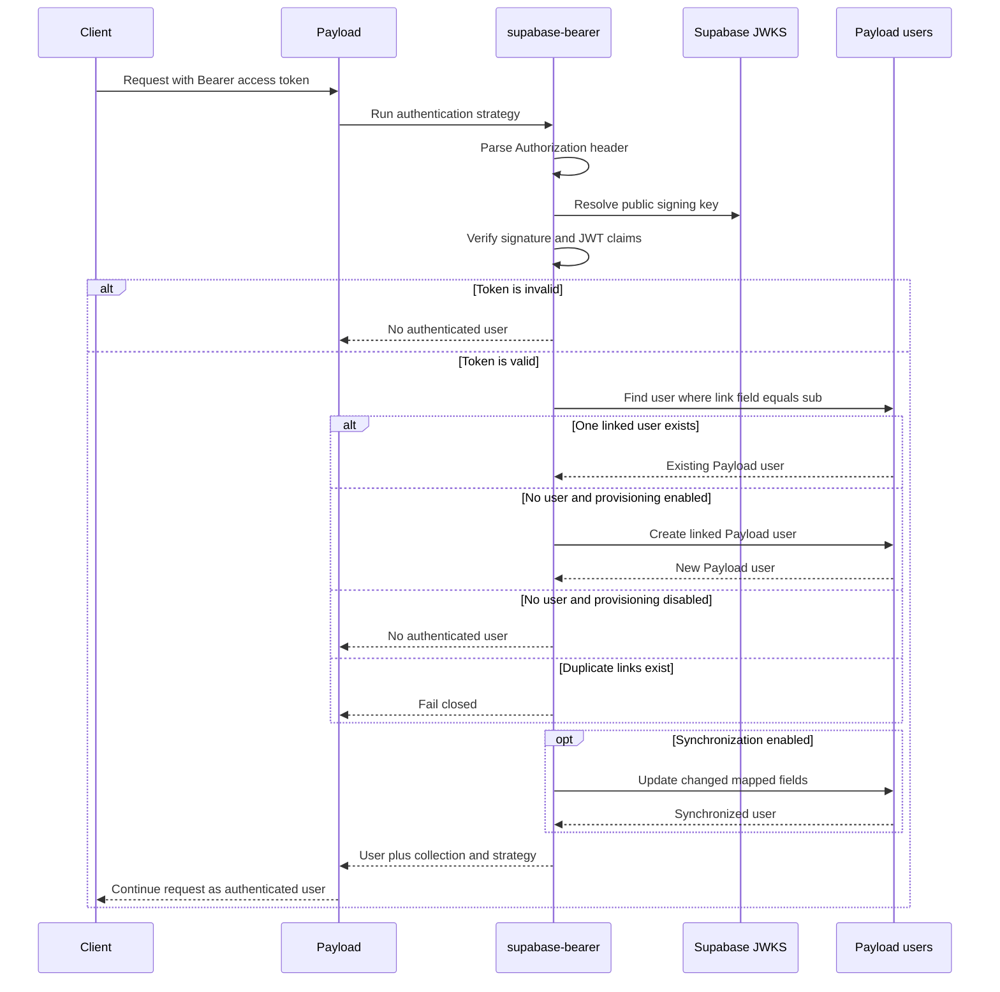
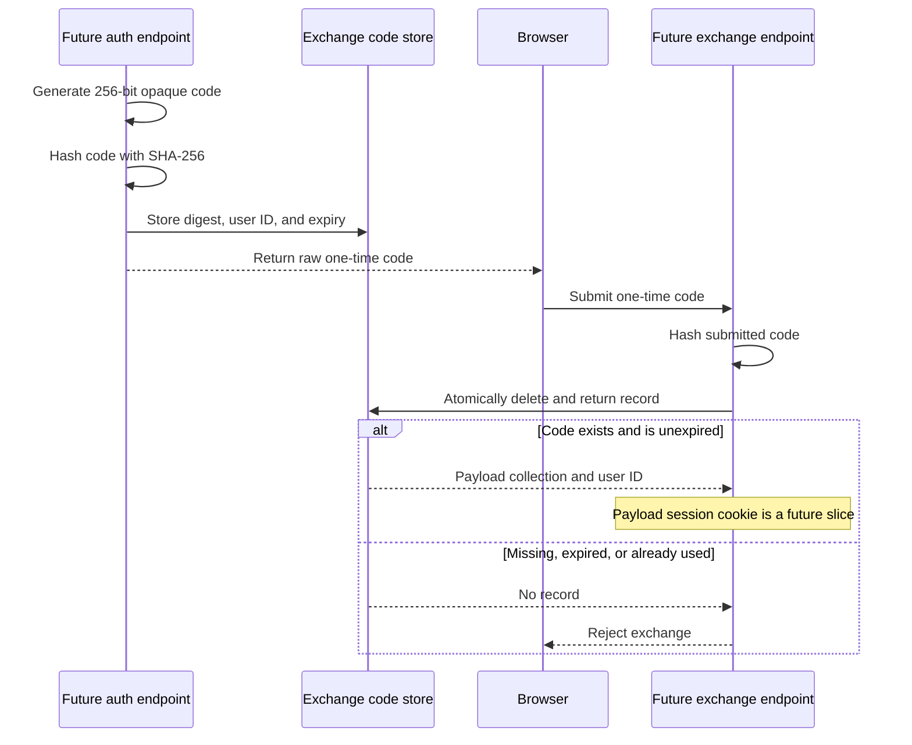

# Project overview

## What this project is

`@dombestein-data/payload-supabase-auth` lets Payload CMS trust identities from
Supabase Auth.

Supabase remains responsible for signing users in and issuing access tokens.
Payload keeps its own user documents, permissions, relationships, and admin
configuration. The package verifies that a Supabase token is genuine, connects
its user ID to one Payload user, and returns that user through Payload's normal
authentication system.

The package currently supports:

- Supabase bearer-token authentication.
- Secure JWT verification through the project's public JWKS.
- Resolving an existing linked Payload user.
- Optional automatic Payload user provisioning.
- Optional synchronization of mapped claims.
- Secure primitives for a future one-time Payload session exchange.

It does not yet provide the exchange HTTP endpoint, a Payload session cookie,
logout endpoints, or a Supabase-powered Payload admin login screen.

## Repository structure

```text
payload-supabase-auth/
├── apps/
│   └── dev/                         Development Payload application
│       ├── src/
│       │   ├── collections/Users.ts Example linked user collection
│       │   └── payload.config.ts    Example plugin configuration
│       └── tests/                   Live PostgreSQL/Supabase tests
├── packages/
│   └── payload-supabase-auth/
│       ├── src/                     Published package source
│       ├── tests/                   Isolated and stateful package tests
│       └── dist/                    Compiled package output
├── docs/
│   ├── architecture.md              Detailed internal architecture
│   ├── overview.md                  This plain-language overview
│   ├── security.md                  Trust boundaries and security rules
│   ├── token-exchange.md             Exchange design and remaining work
│   └── verification.md              Local and live verification guide
├── .changeset/                       Package version and release notes
├── .github/workflows/
│   ├── ci.yml                        Package and optional live CI checks
│   └── release.yml                   Changesets npm release automation
├── eslint.config.mjs                 Root lint ignore/default configuration
├── prettier.config.mjs               Shared formatting defaults
├── tsconfig.base.json                Shared TypeScript compiler defaults
├── vitest.workspace.ts               Combined package and live test projects
├── README.md                        Installation and public usage
└── TESTS.md                         Test inventory and coverage boundaries
```

## Package structure

```text
src/
├── plugin.ts                        Installs the strategy into Payload
├── types.ts                         Top-level plugin options
├── index.ts                         Public package exports
├── token/
│   ├── claims.ts                    Supabase JWT claim types
│   ├── extractBearerToken.ts        Reads Authorization: Bearer
│   └── verifyToken.ts               Verifies JWT signature and claims
├── strategy/
│   └── createSupabaseStrategy.ts    Coordinates the authentication flow
├── users/
│   ├── claimMapping.ts              Maps claims to Payload fields
│   ├── resolveLinkedUser.ts         Finds a user by Supabase subject
│   ├── provisionUser.ts             Creates a missing linked user
│   └── synchronizeUser.ts           Updates changed mapped fields
└── exchange/
    ├── types.ts                     Exchange store contract and records
    ├── digestExchangeCode.ts        Hashes codes before storage
    ├── createExchangeCode.ts        Creates short-lived opaque codes
    ├── consumeExchangeCode.ts       Consumes a code exactly once
    ├── exchangeCodeCollection.ts     Hidden internal collection definition
    ├── createPayloadExchangeCodeStore.ts
    │                                  Shared atomic PostgreSQL store
    └── createMemoryExchangeCodeStore.ts
                                       Test/development-only memory store
```

## How bearer authentication works

### 1. Plugin installation

`supabaseAuthPlugin` runs while Payload builds its configuration. It:

1. Finds the configured auth collection.
2. Confirms that the collection has Payload authentication enabled.
3. Creates the Supabase token verifier.
4. Creates the `supabase-bearer` Payload strategy.
5. Appends it after any existing custom strategies without mutating the
   incoming configuration.

If the plugin is disabled, it changes nothing.

### 2. Token extraction and verification

For each request, the strategy looks for:

```http
Authorization: Bearer <supabase-access-token>
```

Malformed or missing values are treated as anonymous requests.

The verifier loads public keys from the Supabase JWKS endpoint and checks:

- The cryptographic signature.
- The signing algorithm (`ES256` or `RS256`).
- The expected issuer.
- The expected audience.
- Expiration and applicable JWT time claims.
- A non-empty `sub` claim identifying the Supabase user.

### 3. Payload user resolution

The verified `sub` is compared with `supabaseUserId` on the Payload user by
default. The field name is configurable.

The lookup bypasses Payload access control because authentication occurs before
a request has a user. It returns at most two records so duplicate links can be
detected and rejected.

### 4. Optional provisioning

With `provisionUsers: true`, an unlinked identity creates a Payload user.

The default data contains:

- `email` from the verified claims.
- `supabaseUserId` from the verified `sub`.
- A strong random local password that is never returned.

Provisioning requires an email. The subject link cannot be overridden by a
custom claim mapper.

Concurrent first requests are coordinated by the database's unique
`supabaseUserId` constraint. If one request loses the insert race, it resolves
the user created by the winning request.

### 5. Optional claim synchronization

With `synchronizeUsers: true`, mapped fields are compared with the current
Payload user. Only changed values are written, preventing an `updatedAt` change
on every authenticated request.

The default mapper synchronizes only email. `mapClaims` can provide profile or
application fields. Synchronization will not write:

- `id`
- `password`
- `collection`
- The configured Supabase identity-link field

Authorization fields should only come from trusted server-controlled claims
such as validated `app_metadata`, never user-editable metadata.

### Complete bearer flow



## Exchange-code primitives

The exchange module is groundwork for converting a Supabase-authenticated
browser flow into a Payload session later.

`createExchangeCode`:

1. Generates at least 256 bits of random data.
2. Returns the opaque code to the caller.
3. Hashes the code with SHA-256.
4. Stores only the digest, Payload collection, user ID, and expiration.
5. Uses a 60-second lifetime by default.

`consumeExchangeCode` hashes the submitted code and asks the store to atomically
remove and return the matching unexpired record. Atomic removal means two
concurrent requests cannot both use the same code.



The included memory store is only suitable for tests and single-process
development. Production uses the hidden Payload collection and a conditional
PostgreSQL `DELETE … RETURNING` operation so one concurrent consumer wins. The
next implementation step is the endpoint and secure cookie layer.

## Configuration summary

```ts
supabaseAuthPlugin({
  authCollection: 'users',
  supabaseUrl: process.env.SUPABASE_URL,
  provisionUsers: true,
  synchronizeUsers: true,
  mapClaims: (claims) => ({
    displayName: claims.user_metadata?.display_name,
    role: claims.app_metadata?.role,
  }),
})
```

| Option                   | Meaning                                            |
| ------------------------ | -------------------------------------------------- |
| `authCollection`         | Payload auth collection containing linked users.   |
| `supabaseUrl`            | Project used for issuer and JWKS verification.     |
| `issuer`                 | Optional expected JWT issuer override.             |
| `audience`               | Optional expected audience override.               |
| `userIdField`            | Link field; defaults to `supabaseUserId`.          |
| `verifyToken`            | Optional custom verifier.                          |
| `provisionUsers`         | Opt in to creating missing Payload users.          |
| `synchronizeUsers`       | Opt in to updating changed mapped claims.          |
| `mapClaims`              | Maps verified claims to Payload fields.            |
| `exchangeCodeCollection` | Internal shared exchange-code collection slug.     |
| `enableExchangeCodes`    | Controls whether the internal collection is added. |
| `enabled`                | Completely disables the plugin when `false`.       |

## Failure behavior

The bearer strategy fails closed. Missing headers, malformed credentials,
invalid tokens, unlinked users, duplicate links, provisioning failures, and
synchronization failures produce no Supabase-authenticated Payload user.

Payload may then try another configured strategy. The plugin does not disable
Payload local authentication.

## Verification status

The implementation is covered by isolated, stateful, PostgreSQL, and live
Supabase tests. Current coverage includes token validation, provisioning,
repeat resolution, synchronization, tampered-token rejection, access override,
concurrent provisioning, exchange expiry, and concurrent single-use
consumption.

See [TESTS.md](../TESTS.md) and [verification.md](verification.md) for commands
and remaining live checks.
