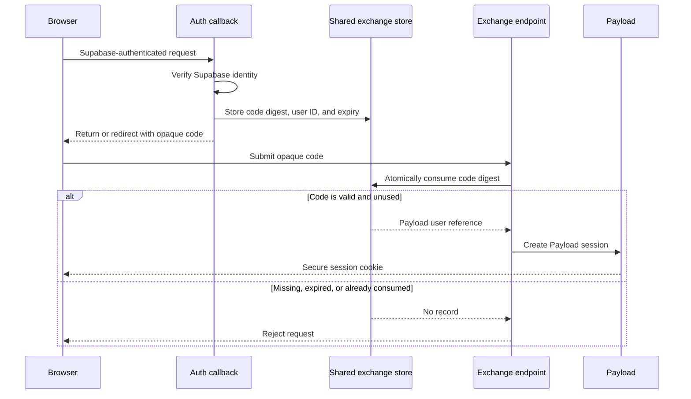

# Token exchange

## Purpose

Bearer authentication is sufficient for API clients, but the future Payload
admin experience needs a secure way to turn an authenticated Supabase browser
flow into a Payload session.

The exchange flow will use a short-lived, single-use code. The Supabase access
token will not be placed in a URL or converted directly into a long-lived
Payload cookie.

## Implemented primitives

The package currently provides:

- `createExchangeCode` to generate an opaque code with at least 256 bits of
  cryptographic entropy.
- `digestExchangeCode` to derive the SHA-256 storage key.
- `consumeExchangeCode` to consume a matching record exactly once.
- `ExchangeCodeStore` as the contract for persistent storage.
- `createMemoryExchangeCodeStore` for tests and single-process development.
- `createPayloadExchangeCodeStore` for shared PostgreSQL persistence.

Codes expire after 60 seconds by default. Only their digests are persisted.
Records contain the Payload auth collection, Payload user ID, and expiration.

## Planned flow

## Required production storage behavior

A production `ExchangeCodeStore` must:

- Be shared by every application instance.
- Enforce unique digests.
- Atomically delete and return one valid record.
- Return `null` for expired, missing, or consumed records.
- Prevent two concurrent consumers from succeeding.
- Support cleanup of expired records.

The plugin adds a hidden `supabase-exchange-codes` collection by default. Its
digest is unique, expiration is indexed, and all normal collection access is
denied. The PostgreSQL store consumes with conditional `DELETE … RETURNING` and
removes expired records with `cleanupExpired()`.

## Remaining implementation

1. Add the authenticated callback or code-creation endpoint.
2. Add the exchange endpoint.
3. Create a Payload session and secure cookie.
4. Add logout and session revocation.
5. Integrate the flow into the Payload admin login UI.

The HTTP layer must review CSRF protection, redirect allow-listing, cookie
attributes, session fixation, response caching, rate limiting, and code leakage
through logs or URLs.
