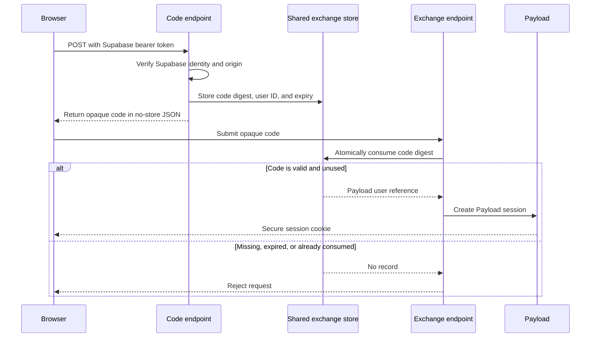

# Token exchange

## Purpose

Bearer authentication is sufficient for API clients, but browser and future
Payload admin flows need a secure way to turn an authenticated Supabase flow
into a Payload session.

The exchange flow will use a short-lived, single-use code. The Supabase access
token will not be placed in a URL or converted directly into a long-lived
Payload cookie.

## Implemented primitives

The package currently provides:

- `createExchangeCode` to generate an opaque code with at least 256 bits of
  cryptographic entropy.
- `digestExchangeCode` to derive the SHA-256 storage key.
- `consumeExchangeCode` to consume a matching record exactly once.
- `ExchangeCodeStore` as the contract for persistent storage.
- `createMemoryExchangeCodeStore` for tests and single-process development.
- `createPayloadExchangeCodeStore` for shared PostgreSQL persistence.
- `createPayloadSession` to create Payload JWTs and persist session IDs when
  Payload sessions are enabled.
- `createPayloadSessionCookie` to serialize the configured HttpOnly cookie.
- `createExchangeEndpoint` for same-origin POST exchange.

Codes expire after 60 seconds by default. Only their digests are persisted.
Records contain the Payload auth collection, Payload user ID, and expiration.

## Exchange flow

## Required production storage behavior

A production `ExchangeCodeStore` must:

- Be shared by every application instance.
- Enforce unique digests.
- Atomically delete and return one valid record.
- Return `null` for expired, missing, or consumed records.
- Prevent two concurrent consumers from succeeding.
- Support cleanup of expired records.

The plugin adds a hidden `supabase-exchange-codes` collection by default. Its
digest is unique, expiration is indexed, and all normal collection access is
denied. The PostgreSQL store consumes with conditional `DELETE … RETURNING` and
removes expired records with `cleanupExpired()`.

## Browser integration

The package's optional Payload admin login panel implements the password-based
version of this flow. A host application can also sign in with its own Supabase
client, call the code endpoint with the resulting bearer token, exchange the
returned code, and then enter its authenticated Payload experience. Both paths
log out through Payload's existing auth-collection logout endpoint.

Both package endpoints validate the request origin and disable response
caching. The code is accepted only in a POST body, and the resulting cookie
uses Payload's configured attributes. Host applications remain responsible for
OAuth and magic-link UIs, redirect allow-listing, abuse controls, and avoiding
code or token leakage through logs.
